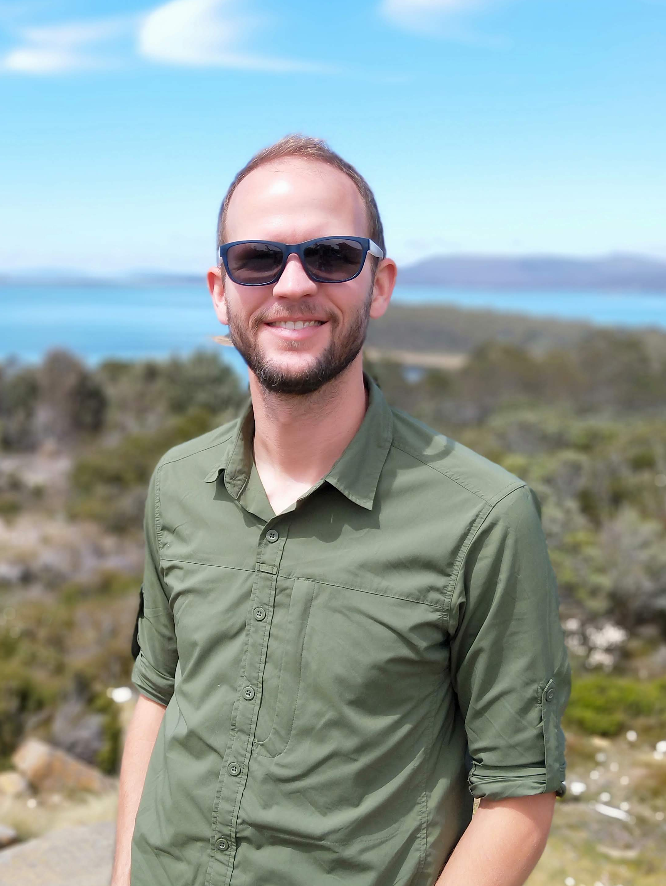
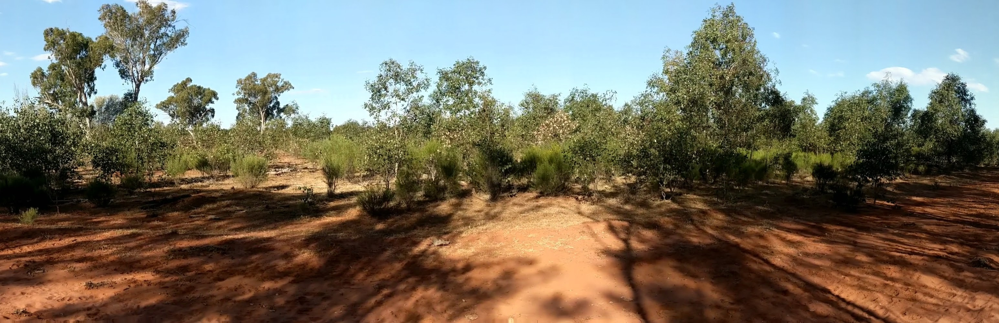
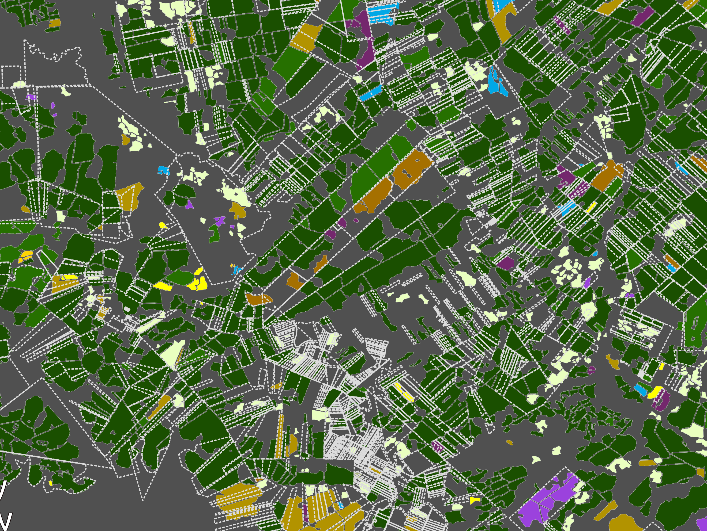
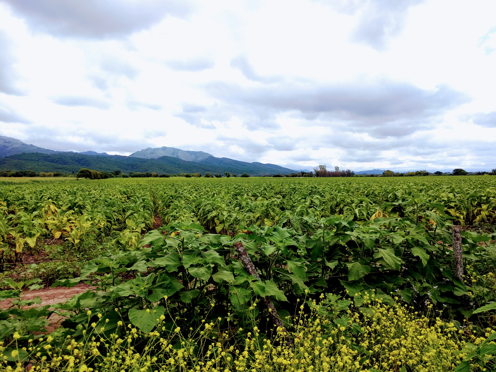
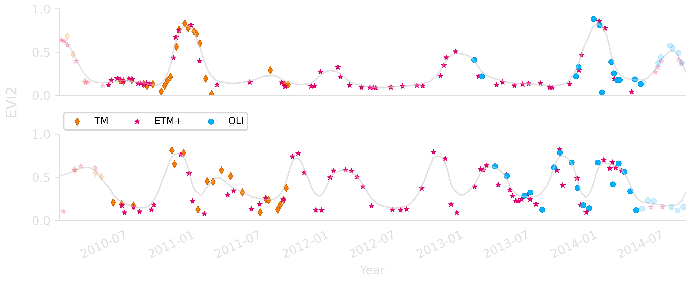

<!-- Main -->

<section id="one">
	

    

        
    

            
    

    
I am a geographer with technical and domain expertise in remote sensing and land change science. My research activities typically involve the characterization of landscape patterns and the analysis of environmental consequences of human land use decisions. Of special interest to me is regional and global agriculture. More specifically, I am interested in developing timely datasets to help guide policy for food security, to improve estimates on crop production, and to identify patterns of intensification and expansion to protect and conserve native habitats. Additionally, I pursue research questions related to changing agrarian practices and small- and large-holder dynamics. My principle tools are remote sensing, image processing, machine learning, time series statistical analyses, and graph networks.
    

    

</section>

<!-- One -->
<section id="one">
	

        <!-- Content -->

        <h2 id="content">Research interests</h2>
        
        

        <h4>Land use/cover change</h4> 
|
 <h4>Landscape patterns & trends</h4> 
|
 <h4>Remote sensing</h4> 
|
 <h4>Spatial-temporal analysis</h4> 
|
 <h4>Food security</h4> 
|
 <h4>Crop monitoring</h4> 
|
 <h4>Machine learning</h4> 
|
 <h4>Human-environmental interactions</h4>
        

        
	

	
</section>

<!-- Two -->
<section id="two" class="spotlights">
	<section>
        

            <h2>Current research projects</h2>
        

	</section>
	<section>		
		<!---->
		

			

				<header class="major">
					<h3>Regeneration of woody vegetation</h3>
				</header>
				
At the University of Queensland, I am developing methods to analyze the regrowth of woody vegetation using long-term Landsat and short-term Sentinel time series.

			

		

	</section>
	<section>
		<!---->
		

			

				<header class="major">
					<h3>Mapping property values</h3>
				</header>
				
Together, <a href="https://bren.ucsb.edu/people/robert-heilmayr">Robert Heilmayr</a>, <a href="https://www.mcgill.ca/geography/people-0/yann-le-polain-de-waroux">Yann le Polain de Waroux</a>, and I will develop methods to estimate property values using remotely sensed data, and investigate the relationships between land value and frontier land speculation in Paraguay and Uruguay.

				<ul class="actions">
					<li><a href="https://lcluc.umd.edu/projects/mapping-property-values-understand-land-use-change-south-america" class="button">Learn more</a></li>
				</ul>
			

		

	</section>
	<section>
		<!---->
		

			

				<header class="major">
					<h3>Field size change</h3>
				</header>
				
As a participant in a <a href="https://www.sesync.org/">SESYNC</a> project investigating agricultural diversity, I am helping to develop a global sample of land cover and field size change. Using Landsat and Sentinel imagery, we are generating time series over two decades to produce annual estimates of landscape changes.

				<ul class="actions">
					<li><a href="https://www.sesync.org/project/pursuit-program/can-enhancing-diversity-help-scale-up-agricultures-benefits-to-people-and" class="button">Learn more</a></li>
				</ul>
			

		

	</section>
	<section>
		<!---->
		

			

				<header class="major">
					<h3>Time series reconstruction</h3>
				</header>
				
Satellite data can be useful for time series analyses. However, image acquisitions for most satellites do not occur daily, and clear-sky observations are not guaranteed. Therefore, smoothing methods are necessary in order to reconstruct continuous time series profiles. With colleagues at Boston University, I am developing a time series reconstruction method with dynamically-adjusting parameters based on phenology. 

			

		

	</section>
	<section>
		<!---->
		

			

				<header class="major">
					<h3>Land use/cover mapping in South America</h3>
				</header>
				
Working with colleagues at the <a href="https://www.argentina.gob.ar/inta">Instituto Nacional de Tecnolog&iacute;a (INTA)</a>, <a href="https://www.bolsadecereales.com/">Bolsa de Cereales</a>, and Boston University, I am generating land cover and land use maps across the Southern Cone. Broadly, our goals are to: 1) better understand human- and climate-driven environmental impacts on the region; 2) investigate changes in patterns of small- and large-holder agriculture across space and time; and 3) improve methods for long-term land cover mapping and short-term crop cycle estimates.

			

		

	</section>
</section>
