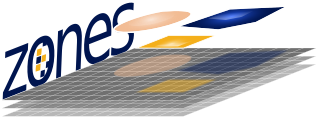

<div class="6u$ 12u$(medium)">

<!-- Buttons -->
<h3>GitHub repositories</h3>

<hr>

<ul class="actions">
    <li></li>
	<li><a href="https://geowombat.readthedocs.io" class="button">see more on github</a></li>
	<blockquote>A Python library for raster and vector utilities</blockquote> 
</ul>

<p>
<div>
<b>What can I use it for?</b>
</div>
<div>- Raster I/O with images of any size</div>
<div>- Scalable data processing for high-performance compute systems</div>
<div>- Remote sensing workflows</div>
</p>

<b>Example usage:</b>

</div>

```python
import geowombat as gw

# Manage sensor configurations
with gw.config.update(sensor='s2'):

    # Open satellite images as Xarray DataArrays
    with gw.open('L1C_T20HPH_A007071_20161029T141104_MTD.tif') as src:
    
        # Setup task workflows
        ndvi = src.gw.ndvi(scale_factor=0.0001)

        # Execute the task with parallel processing
        ndvi.gw.to_raster('ndvi.tif',
                          n_workers=8,
                          n_threads=4,
                          compress='lzw')
```

<hr>

<div class="6u$ 12u$(medium)">

<ul class="actions">
	<li><h2>cultionet</h2></li>
    	<li><a href="https://github.com/jgrss/cultionet" class="button">see more on github</a></li>
        <blockquote>A Python library for semantic segmentation of cultivated land using graph neural networks</blockquote>
</ul>
</div>

<hr>

<div class="6u$ 12u$(medium)">

<ul class="actions">
	<li><h2>SatSmooth</h2></li>
    	<li><a href="https://github.com/jgrss/satsmooth" class="button">see more on github</a></li>
        <blockquote>A Python library for smoothing satellite signals</blockquote>
</ul>
</div>

<hr>

<div class="6u$ 12u$(medium)">

<ul class="actions">
    <li></li>
    <li><a href="https://github.com/jgrss/zones" class="button">see more on github</a></li>
	<blockquote>A Python library for raster and vector zonal statistics</blockquote> 
</ul>

<p>
<div>
<b>What can I use it for?</b>
</div>
<div>- Zonal statistics over millions of zones</div>
</p>

<b>Example usage:</b>

</div>

```python
import zones

zs = zones.RasterStats('values.tif', 'zones.gpkg', verbose=2)

# Calculate the mean of 'values.tif' within each zone of 'zones.gpkg'
df = zs.calculate('mean')

# Save the results to file
df.to_file('stats.gpkg')
```

<hr>

<div class="6u$ 12u$(medium)">

<ul class="actions">
    <li><h2>SpFeas</h2></li>
	<li><a href="https://jgrss.github.io/spfeas/" class="button">see more on github</a></li>
	<blockquote>A Python library for spatial feature extraction from satellite imagery</blockquote>
</ul>

<p>
<div>
<b>What can I use it for?</b>
</div>
<div>- Generation of multi-scale raster layers</div>
</p>

<b>Example usage:</b>

<div>
Blog on <a href="https://blogs.worldbank.org/latinamerica/trinidad-space-using-satellite-imagery-better-urban-management">Urban mapping at The World Bank</a>
</div>

<div>
Conference paper on <a href="http://www.iariw.org/washington/Newhouse-paper.pdf">The Spatial Distribution of Poverty in Sri Lanka in 2016</a>
</div>

</div>
